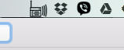
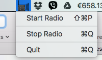

# Simple Status-Bar Radio Player 
### Start/stop your favorite internet radio station with this simple status bar app.

## Installation

* [Install VLC](http://www.videolan.org/vlc/)
* Create this simple bash script (name it ```vlc```):
```
#!/usr/bin/env bash

/Applications/VLC.app/Contents/MacOS/VLC -I rc "$@"
```
* Save this to /usr/local/bin and then make it executable

```
chmod +x /usr/local/bin/vlc
```
* Run the app.
* You can change the radio station from the variable ```url``` in the app delegate.

### Screenshots




### Helpful links

* [Run VLC from the command line on Mac OS X and stream internet radio (such as Radio Paradise).](https://gist.github.com/kgriffs/6393192)
* [OS X Tutorial: Menus and Popovers in Menu Bar Apps](https://www.raywenderlich.com/98178/os-x-tutorial-menus-popovers-menu-bar-apps)
